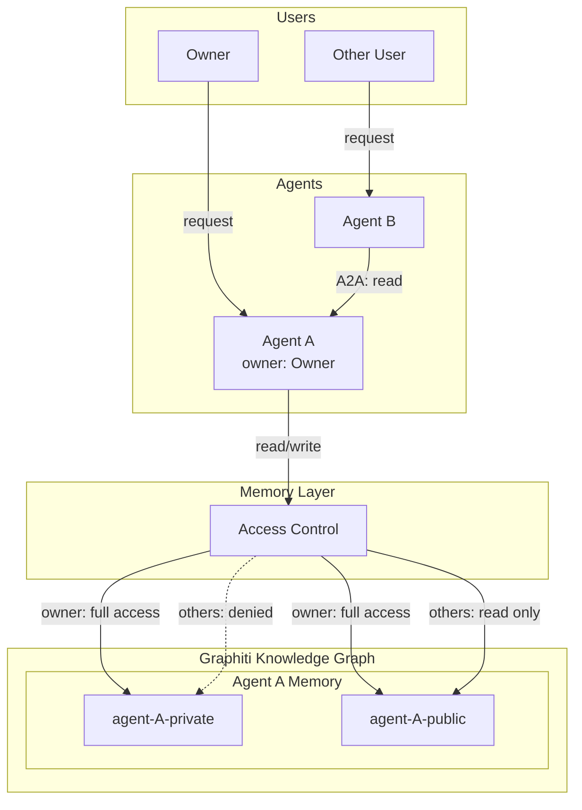
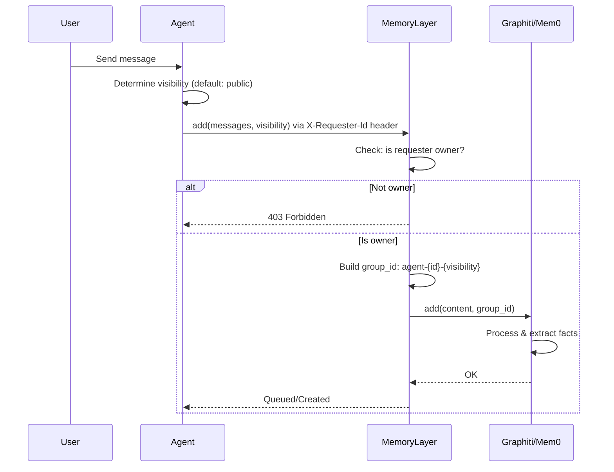
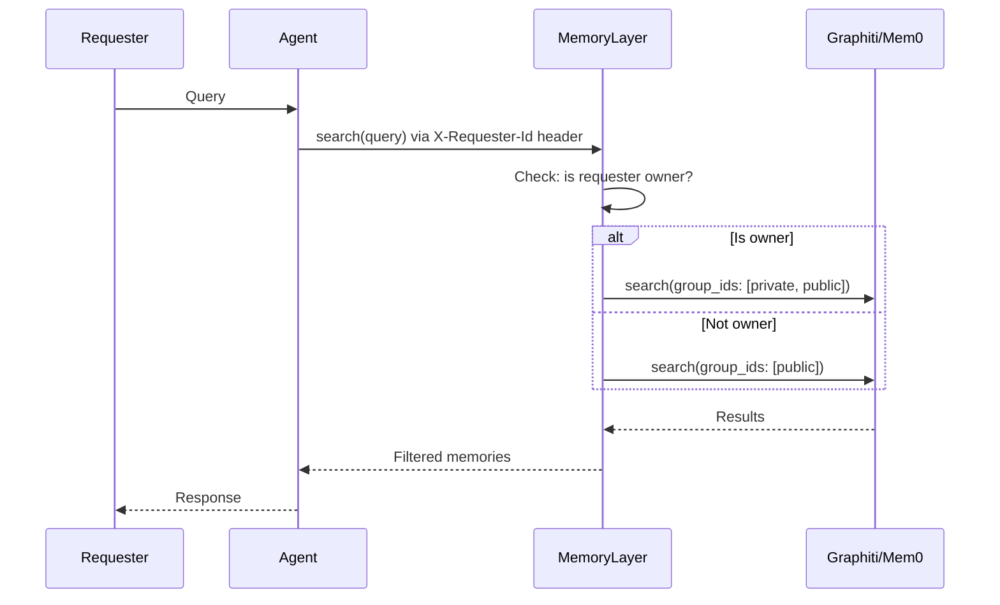

# Memory Isolation Design

## Overview

A4S provides isolated memory spaces for agents using Graphiti's knowledge graph with `group_id`-based namespacing. Each agent maintains two memory spaces: private and public.

## End-to-End Flow



### Write Flow



### Read Flow



## Core Concepts

### Ownership Model

- Each agent has exactly one **owner** (1:1 relationship)
- Owner is assigned by admin or agent creator
- Only agents are first-class entities in the memory system

### Memory Spaces

Each agent has two isolated memory spaces:

| Space   | group_id Pattern           | Access     |
| ------- | -------------------------- | ---------- |
| Private | `agent-{agent_id}-private` | Owner only |
| Public  | `agent-{agent_id}-public`  | Anyone     |

### Access Rules

| Requester | Private Space     | Public Space      |
| --------- | ----------------- | ----------------- |
| Owner     | Read/Write/Delete | Read/Write/Delete |
| Others    | No access         | Read only         |

### Visibility Determination

- **Default**: Public (most memories are expected to be public)
- **Explicit override**: Agent marks memory as private at write time
- **Content-based rules**: Optional auto-classification based on patterns (future)

**Important**: Sensitive information (credentials, API keys, PII) must not be stored in memory at all.

#### Heuristics

| Heuristic                               | Private                                                 | Public                                             |
| --------------------------------------- | ------------------------------------------------------- | -------------------------------------------------- |
| **Owner-specific vs General knowledge** | Facts tied to the owner (preferences, history, context) | Domain knowledge applicable to anyone              |
| **Temporal relevance**                  | Short-term context (current task, session state)        | Long-term knowledge (learned skills, stable facts) |
| **Utility scope**                       | Only useful for this owner's interactions               | Useful for any agent serving any user              |

Examples:

| Memory                                            | Heuristic               | Visibility |
| ------------------------------------------------- | ----------------------- | ---------- |
| "User prefers concise responses"                  | Owner-specific          | Private    |
| "Python's GIL limits true parallelism"            | General knowledge       | Public     |
| "Currently debugging auth flow in user's project" | Short-term context      | Private    |
| "JWT tokens should be validated on every request" | Stable + broadly useful | Public     |

## group_id Structure

```
agent-{agent_id}-private   # Owner-only access
agent-{agent_id}-public    # Global read access
```

Examples:

```
agent-assistant-001-private
agent-assistant-001-public
agent-researcher-042-private
agent-researcher-042-public
```

## Design Decision: Per-Space vs Per-Memory Granularity

### Option A: Per-Space Granularity (Recommended)

Visibility is determined by which space the memory is written to.

```python
# Writing to private space
await memory.add(
    content="User's API key is xyz",
    agent_id="assistant-001",
    visibility="private"  # -> group_id: agent-assistant-001-private
)

# Writing to public space
await memory.add(
    content="Python is a programming language",
    agent_id="assistant-001",
    visibility="public"  # -> group_id: agent-assistant-001-public
)
```

**Pros:**

- Simple implementation using Graphiti's native group_id
- Clean separation - no filtering logic needed
- Better query performance (search targets single group_id)
- Easier to extend for bounded scopes later

**Cons:**

- Cannot change visibility after write (must delete and re-add)
- Two separate searches needed for owner queries

### Option B: Per-Memory Granularity

Each memory has a visibility attribute, stored in same space.

```python
await memory.add(
    content="User's API key is xyz",
    agent_id="assistant-001",
    metadata={"visibility": "private"}
)
```

**Pros:**

- Single group_id per agent
- Could change visibility post-write

**Cons:**

- Requires post-query filtering (performance hit)
- Risk of data leakage if filtering fails
- More complex access control logic
- Graphiti doesn't natively support metadata-based filtering

### Recommendation

**Per-Space Granularity (Option A)** is recommended because:

1. Leverages Graphiti's native isolation mechanism
2. No risk of accidental data leakage
3. Simpler implementation and maintenance
4. Better performance characteristics

## API Design

### Memory Request Model

```python
class CreateMemoryRequest(BaseModel):
    messages: str | list[dict]
    agent_id: str  # Required
    visibility: Literal["private", "public"] = "public"
    metadata: dict | None = None

class SearchMemoryRequest(BaseModel):
    query: str
    agent_id: str  # Required
    limit: int = 10
    # Note: requester_id comes from X-Requester-Id header
```

### Headers

All memory operations require the `X-Requester-Id` header for access control:
- `POST /memories` - requester must be owner to write
- `POST /memories/search` - owner sees private+public, others see public only
- `DELETE /memories/{id}` - requester must be owner to delete

### Access Control Flow

```
Write Request
    |
    v
Is requester the owner?
    |
    +-- No --> Reject (403)
    |
    +-- Yes --> Write to agent-{id}-{visibility}


Read Request
    |
    v
Is requester the owner?
    |
    +-- Yes --> Search both private and public spaces
    |
    +-- No --> Search public space only
```

### Implementation Sketch

```python
class GraphitiMemoryManager:
    def _build_group_ids(
        self,
        agent_id: str,
        requester_id: str,
        owner_id: str
    ) -> list[str]:
        """Determine which group_ids to search based on access."""
        if requester_id == owner_id:
            return [
                f"agent-{agent_id}-private",
                f"agent-{agent_id}-public",
            ]
        return [f"agent-{agent_id}-public"]

    def _build_write_group_id(
        self,
        agent_id: str,
        visibility: str
    ) -> str:
        """Determine group_id for writing."""
        return f"agent-{agent_id}-{visibility}"
```

## Agent-to-Agent (A2A) Access

When Agent A accesses Agent B's memory:

1. Agent A sends request through A2A protocol
2. Agent A is treated as "other" (not owner)
3. Agent A can only read Agent B's public space
4. Agent A cannot write to Agent B's memory

```
Agent A                    Agent B
   |                          |
   |-- A2A: search memory --> |
   |                          |
   |                   [Check: A != owner]
   |                   [Search public only]
   |                          |
   | <-- public results ----- |
```

## Future Considerations

### Bounded Scope for Public Access

Current: Public means globally visible to all users.

Future options to consider:

1. **Organization scope**: `agent-{id}-public-org-{org_id}`
2. **Team scope**: `agent-{id}-public-team-{team_id}`
3. **Explicit sharing**: Whitelist of agents/users who can access

Migration path:

- Add `scope` field to memory requests
- Extend group_id pattern: `agent-{id}-{visibility}-{scope}`
- Default scope to "global" for backward compatibility

### Content-Based Auto-Classification

Rules engine for automatic visibility assignment:

```python
class VisibilityRule(BaseModel):
    pattern: str  # regex or keyword match
    visibility: Literal["private", "public"]

# Example rules
rules = [
    VisibilityRule(pattern=r"(api.key|password|secret)", visibility="private"),
    VisibilityRule(pattern=r"(preference|personal)", visibility="private"),
]
```

### Memory Sharing Between User's Agents

If needed later, could introduce shared spaces:

```
agent-{id}-private           # Agent-specific private
agent-{id}-public            # Agent-specific public
user-{user_id}-shared        # Shared across user's agents
```
