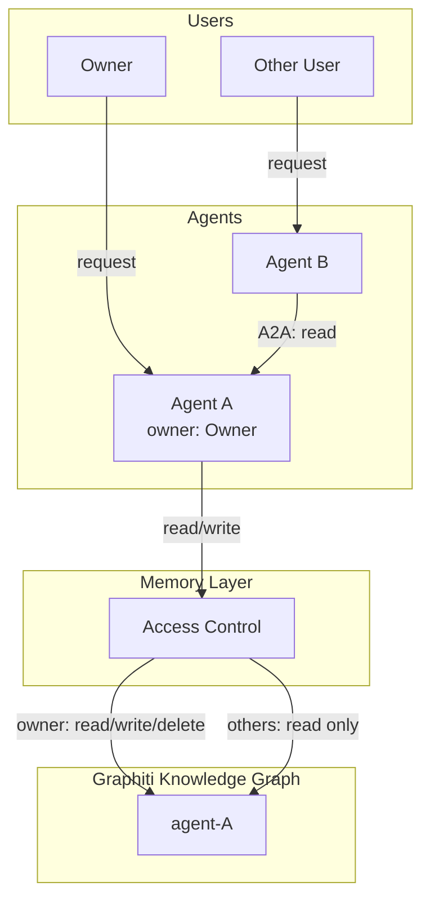
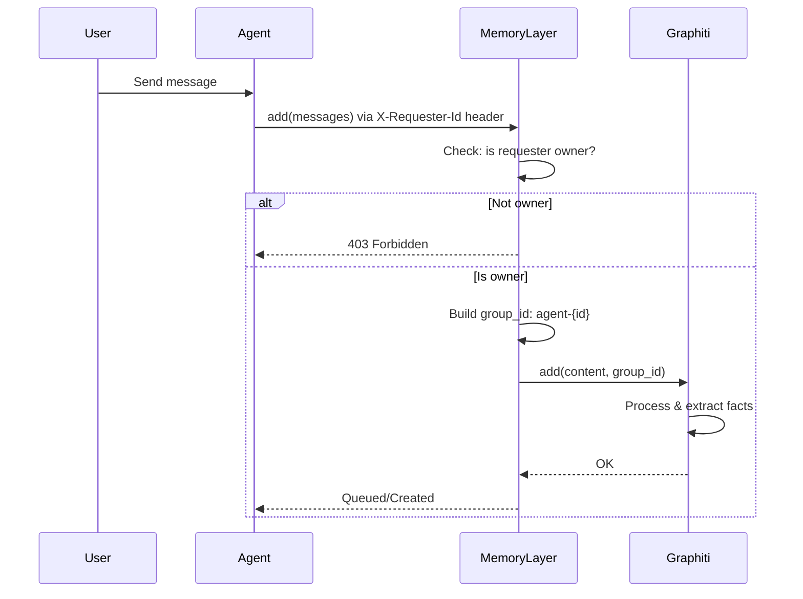
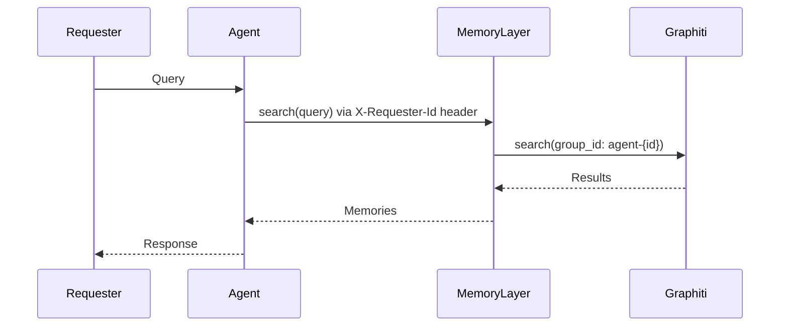

# Memory Design

## Overview

A4S provides memory storage for agents using Graphiti's knowledge graph with `group_id`-based namespacing. All memories are public and readable by anyone. Only the owner can write or delete memories.

## End-to-End Flow



### Write Flow



### Read Flow



## Core Concepts

### Ownership Model

- Each agent has exactly one **owner** (1:1 relationship)
- Owner is assigned by admin or agent creator
- Only agents are first-class entities in the memory system

### Memory Access

| Requester | Read | Write | Delete |
| --------- | ---- | ----- | ------ |
| Owner     | Yes  | Yes   | Yes    |
| Others    | Yes  | No    | No     |

## group_id Structure

```
agent-{agent_id}
```

Examples:

```
agent-assistant-001
agent-researcher-042
```

## API Design

### Memory Request Model

```python
class CreateMemoryRequest(BaseModel):
    messages: str | list[dict]
    agent_id: str  # Required
    metadata: dict | None = None

class SearchMemoryRequest(BaseModel):
    query: str
    agent_id: str  # Required
    limit: int = 10
    # Note: requester_id comes from X-Requester-Id header
```

### Headers

Memory operations require the `X-Requester-Id` header for access control:
- `POST /memories` - requester must be owner to write
- `POST /memories/search` - anyone can search
- `DELETE /memories/{id}` - requester must be owner to delete

### Access Control Flow

```
Write/Delete Request
    |
    v
Is requester the owner?
    |
    +-- No --> Reject (403)
    |
    +-- Yes --> Proceed

Read Request
    |
    v
Search agent-{id} (no restrictions)
```

## Agent-to-Agent (A2A) Access

When Agent A accesses Agent B's memory:

1. Agent A sends request through A2A protocol
2. Agent A can read Agent B's memories
3. Agent A cannot write to Agent B's memory

```
Agent A                    Agent B
   |                          |
   |-- A2A: search memory --> |
   |                          |
   |                   [Search memories]
   |                          |
   | <-- results ------------ |
```

## Important Notes

**NEVER store sensitive info (credentials, API keys, passwords, PII) in memory.** All memories are readable by anyone.
