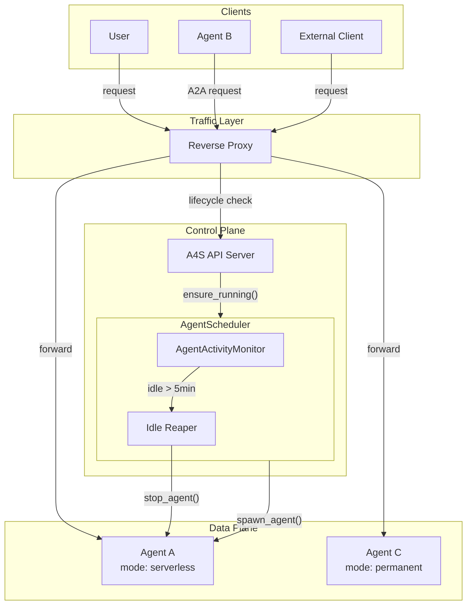
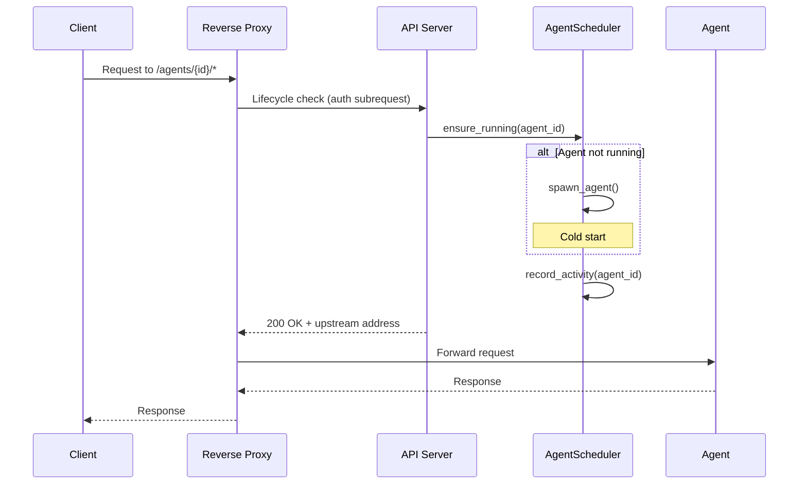
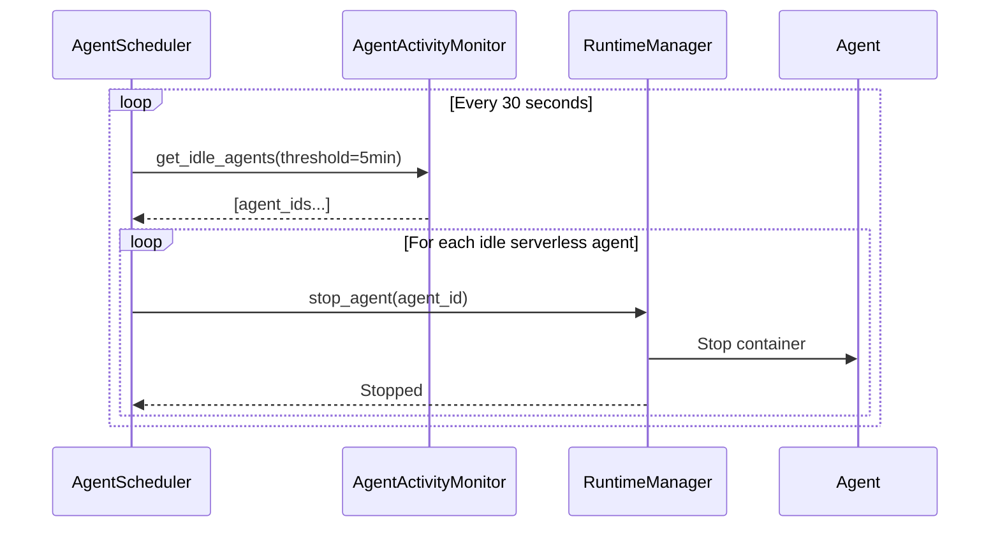

# Serverless Runtime Design

## Overview

A4S supports on-demand agent execution similar to AWS Lambda. Agents are spawned when a request arrives and automatically terminated after a period of inactivity. This reduces resource usage for infrequently accessed agents while maintaining the option for always-on (permanent) agents.

## End-to-End Flow



### Request Flow (Serverless Agent)



### Idle Termination Flow



## Core Concepts

### Agent Modes

| Mode       | Behavior                                | Use Case                              |
| ---------- | --------------------------------------- | ------------------------------------- |
| Serverless | Spawned on-demand, terminated when idle | Infrequent access, cost optimization  |
| Permanent  | Always running, never auto-terminated   | High availability, low latency needed |

**Default**: Serverless (opt-in for permanent)

### Lifecycle States

```
Registered (not running)
    │
    ▼ ─── request arrives
Spawning (cold start)
    │
    ▼ ─── container healthy
Running
    │
    ▼ ─── idle > 5 minutes
Terminated
    │
    ▼ ─── next request
Spawning (cold start)
    ...
```

### Configuration

| Parameter         | Default    | Description                                  |
| ----------------- | ---------- | -------------------------------------------- |
| `mode`            | serverless | Agent execution mode                         |
| `idle_timeout`    | 300s       | Seconds of inactivity before termination     |
| `reaper_interval` | 30s        | How often idle reaper checks for idle agents |

## Design Decisions

### Decision 1: Default Mode

**Choice: Serverless by default**

| Option             | Pros                               | Cons                                |
| ------------------ | ---------------------------------- | ----------------------------------- |
| Serverless default | Resource efficient, scales to zero | Cold start latency on first request |
| Permanent default  | No cold starts                     | Wastes resources for idle agents    |

Serverless default chosen because most agents are accessed infrequently. Users can opt into permanent mode for latency-sensitive agents.

### Decision 2: Traffic Routing Architecture

**Choice: Reverse Proxy with API as Control Plane**

| Option           | Pros                                           | Cons                                  |
| ---------------- | ---------------------------------------------- | ------------------------------------- |
| API Gateway      | Simple, no extra infrastructure                | API becomes bottleneck, lower throughput |
| Reverse Proxy    | High throughput, separation of concerns        | Additional infrastructure             |
| Per-Agent Sidecar| No central bottleneck, fault tolerant          | High resource overhead (N sidecars)   |

Reverse proxy chosen because:

- **Separation of concerns**: Proxy handles traffic (data plane), API handles lifecycle (control plane)
- **Scalability**: Native proxies (Nginx/Traefik) handle 10k+ rps vs Python async
- **Client transparency**: Clients hit proxy URLs, lifecycle is invisible
- **Future-proof**: Easy migration to service mesh (Istio) or Kubernetes ingress

### Decision 3: Scheduler Architecture

**Choice: Separate AgentScheduler class**

| Option                       | Pros                                               | Cons                         |
| ---------------------------- | -------------------------------------------------- | ---------------------------- |
| Extend DockerRuntimeManager  | Simpler, less abstraction                          | Mixes concerns in one class  |
| Separate AgentScheduler | Clean separation, testable, works with any runtime | More indirection, more files |

Separate class chosen because:

- Single responsibility: RuntimeManager handles containers, Scheduler handles lifecycle
- Testable: can mock RuntimeManager for unit tests
- Future-proof: works with Kubernetes, ECS, or other runtimes without changes

### Decision 4: Request Buffering

**Choice: Block at proxy during cold start**

| Option              | Pros                          | Cons                             |
| ------------------- | ----------------------------- | -------------------------------- |
| Block at proxy      | Simple, no queue management   | Ties up proxy connection         |
| External queue      | Persistent, survives restarts | Added complexity, new dependency |

Block at proxy chosen for simplicity. Auth subrequest waits for cold start to complete, then proxy forwards.

### Decision 5: Cold Start Strategy

**Choice: Measure first, optimize later**

| Option         | Pros                     | Cons                       |
| -------------- | ------------------------ | -------------------------- |
| Accept latency | Simplest implementation  | Unknown performance impact |
| Warm pool      | Faster cold starts       | Complex, resource overhead |
| Measure first  | Data-driven optimization | Delays optimization        |

Measure first chosen to validate whether optimization is needed before investing in complexity.

## Architecture Components

### Component Responsibilities

| Component              | Layer         | Responsibility                                      |
| ---------------------- | ------------- | --------------------------------------------------- |
| Reverse Proxy          | Traffic       | Route requests, auth subrequest for lifecycle       |
| API Server             | Control Plane | Lifecycle check endpoint, registry, configuration   |
| AgentScheduler    | Control Plane | On-demand spawning, activity tracking, idle reaping |
| AgentActivityMonitor   | Control Plane | Tracks last request timestamp per agent             |
| RuntimeManager         | Data Plane    | Container lifecycle (spawn, stop, status)           |

### AgentCard Discovery

Containers serve their own AgentCards (standard A2A pattern, compatible with Google ADK).

| Concern | Solution |
| ------- | -------- |
| Container doesn't know external URL | Inject `A4S_AGENT_URL` env var at spawn time |
| ADK generates AgentCard | ADK reads env var for `url` field |
| Discovery request routing | Proxy routes `/.well-known/agent.json` like any request |

**AgentCard URL format**: `{agent_gateway_url}/agents/{agent_id}/`

### Reverse Proxy Interface

| Route Pattern        | Behavior                                              |
| -------------------- | ----------------------------------------------------- |
| `/agents/{id}/*`     | Auth subrequest → forward to upstream from response   |

### API Lifecycle Endpoint

| Endpoint                              | Method | Description                                    |
| ------------------------------------- | ------ | ---------------------------------------------- |
| `/api/v1/agents/{id}/ensure-running`  | POST   | Ensure agent running, record activity          |

### AgentScheduler Interface

| Method            | Description                                   |
| ----------------- | --------------------------------------------- |
| `ensure_running`  | Spawn agent if not running, return when ready |
| `record_activity` | Update last activity timestamp for agent      |
| `start`           | Start background idle reaper task             |
| `stop`            | Stop idle reaper and cleanup                  |

## Model Changes

| Model                  | Change                                   |
| ---------------------- | ---------------------------------------- |
| `AgentMode`            | New enum: `SERVERLESS`, `PERMANENT`      |
| `RegisterAgentRequest` | Add `mode` field (default: `SERVERLESS`) |
| `Agent`                | Add `mode`, `spawn_config` fields        |

### Container Environment Variables

| Variable        | Value                             | Purpose                  |
| --------------- | --------------------------------- | ------------------------ |
| `A4S_AGENT_URL` | `http://{proxy}/agents/{id}/`     | AgentCard URL generation |

## Metrics and Observability

### Cold Start Metrics

| Metric                   | Type    | Description                        |
| ------------------------ | ------- | ---------------------------------- |
| `cold_start_count`       | Counter | Number of cold starts              |
| `cold_start_latency_p50` | Gauge   | 50th percentile cold start latency |
| `cold_start_latency_p95` | Gauge   | 95th percentile cold start latency |
| `cold_start_latency_p99` | Gauge   | 99th percentile cold start latency |

### Activity Metrics

| Metric                       | Type    | Description                           |
| ---------------------------- | ------- | ------------------------------------- |
| `active_serverless_agents`   | Gauge   | Currently running serverless agents   |
| `idle_terminations_total`    | Counter | Agents terminated due to idle timeout |
| `requests_during_cold_start` | Counter | Requests that triggered a cold start  |

## Future Considerations

### Warm Pool

If cold start latency becomes problematic:

1. Maintain pool of pre-spawned generic containers
2. On request, assign container to agent and inject config
3. Trade-off: resource usage vs latency

### Predictive Scaling

Use request patterns to pre-warm agents:

- Time-based: warm up agents before expected usage (e.g., business hours)
- Pattern-based: detect request patterns and pre-warm

### Per-Agent Configuration

Allow agents to override default settings:

| Field           | Description                                |
| --------------- | ------------------------------------------ |
| `idle_timeout`  | Override default idle timeout              |
| `min_instances` | Minimum warm instances (for warm pool)     |
| `max_instances` | Maximum instances (for horizontal scaling) |

### Horizontal Scaling

Multiple instances of same agent for high traffic:

- Load balancer distributes requests
- Shared state via external storage
- Independent idle tracking per instance
